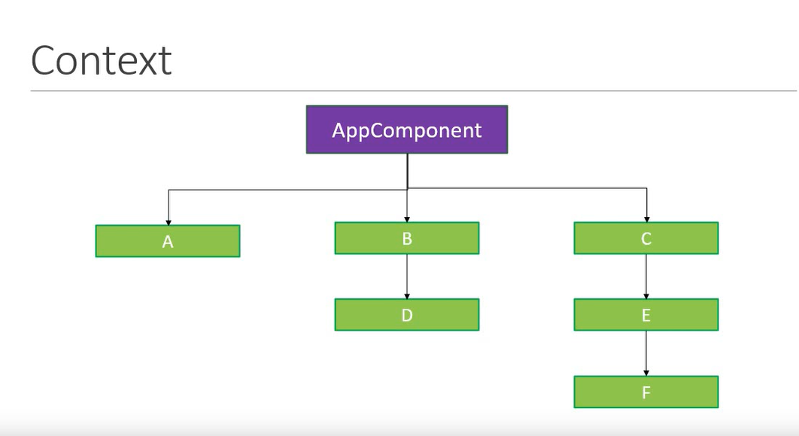
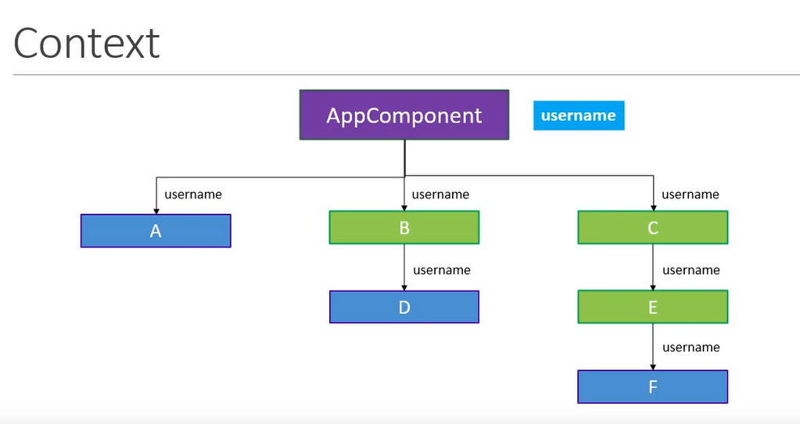
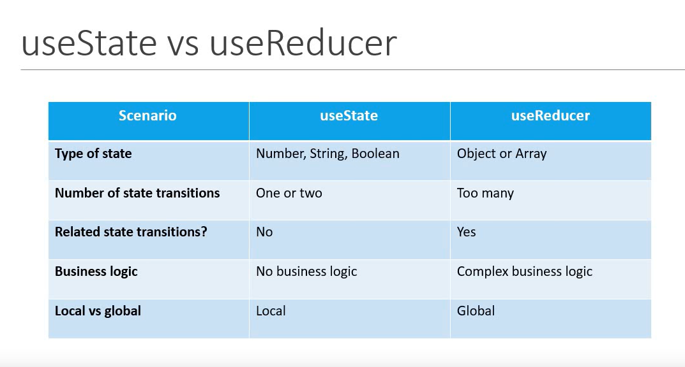

1. what are hooks?
   Hooks are a new feature addition in react version 16.8 which allow you to use React features without having to write a class.
Example: State of a component
Hooks don't work inside classes.

2. Why Hooks?
Reason Set 1:
Understand how this keyword works in javascript.
Remember to bind the event handler in class components.
Classes don't minify very well and make hot reloading very unreliable.

Reason set 2:
There is no particular way to reuse stateful component logic
HOC and render props patterns do address this problem
makes the code harder to follow
There is need a to share stateful login in better way

Reason set 3:
create component for complex scenario such as data fetching and subscribing to events.
Related code is not organized in one place
Example: Data fetching -  In componentDidMount and componentDidUpdate
Example: Event listeners - In componentDidMount and componentWillUnmount
Because of stateful logic - cannot break component into smaller ones.

Summary - useState
1. The useState hook lets you add state to functional component.
2. In classes, the state is always an object.
3. With useState hook, the state doesn't have to be an object.
4. The useState hook returns an array with 2 elements.
5. The first element is the current value of the state, and the second element is a state setter function.
6. New state value depends on the previous state value? you can pass a function to the setter function.
7. when dealing with objects or arrays, always make sure to spread your state variable and then call the setter function.

----------------------------------------------------------------------------------------------------

useEffect

consider the sideeffects.
1. Updating the document title to the current counter value
   
   componentDidMount(){
      document.title = `You clicked ${this.state.count} times`;
   }

   componentDidUpdate(){
      document.title = `You clicked ${this.state.count} times`;
   }

2. Timer
   componentDidMount(){
      this.interval = setInterval(this.tick, 1000)
   }

   componentWillUnmount(){
      clearInterval(this.interval)
   }

3. combine both
   // code is repeated
   // if we combine this with above, then the code related to timer will be put in different lifecycle methods.
   componentDidMount(){
      document.title = `You clicked ${this.state.count} times`;
      this.interval = setInterval(this.tick, 1000)
   }
   componentDidUpdate(){
      document.title = `You clicked ${this.state.count} times`;
   }

   componentWillUnmount(){
      clearInterval(this.interval)
   }
1. The effectHook lets you perform side effects in functional component.
2. It is a close replacement for componentDidMount, componentDidUpdate and componentWillUnmount.

------------------------------------------------------------------------------

context in react
context provides a way to pass data through the components tree withouy having to pass props down manually at every level.

props drilling

Now check how to pass data from App component to F component. C-> E -> F
1. create context
2. Provider must wrap the children compoennt with value avilable and provide context value.
3. consume context value

** useContext Hooks only makes the consumption of the value simples. 1 and 2 steps remains same
we will use useContext hook in component E

-------------------------------------------------------------------------------

useReducer
1. useReducer is a hook that is used for state management.
2. it is an alternative to useState
3. what is the difference?
4. useState is built using useReducer.
5. When to useReducer vs useState.

useReducer -> reducers

https://developer.mozilla.org/en-US/docs/Web/JavaScript/Reference/Global_Objects/Array/reduce

reduce 
1. array.reduce(reducer, initialValue)
2. singleValue = reducer(accumulator, itemValue)
3. reduce method returns a single value

 useReducer
 1. useReducer(reducer, initialState)
 2. newState = reducer(currentState, action)
 3. useReducer return a pair of values [newState, dispatch]

 useReducer with useContext
 1. useReducer - Local state management
 2. share state between components - Global state management
 3. useReducer + useContext
 

 useState vs useReducer
  

  React.memo - > is a HOC which prevents functional component from rerender if its props or states do not change.
  React memo -> when we click on increment Age we see Increment salary logs. 
  The reson we are getting logs is.new  incrementsalary function is creted each time parent compoennt rerenders.
  since the function is a props here. react.memo thinks that the props has changesd and will not prevent the rerender.

  useCallback hooks
  what?
  useCallback is a hook that will return a memoized version of the callback fucntion that only changes if one of the dependecies has changed.

  why?
  It is useful when passing callback to optimized child component that rely on the reference equality to prevent unnecessary render.

   

